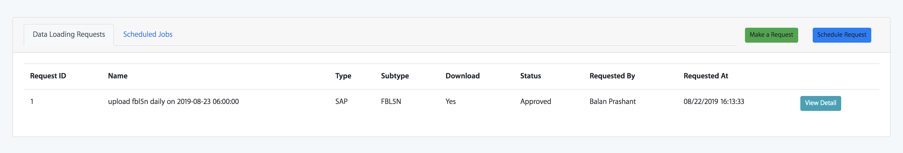
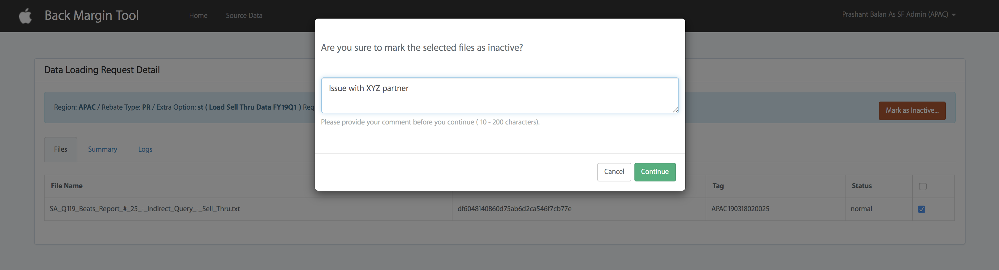

Example Application
===================

Assuming that we have installed the package already as explained [here][1], now we can begin with customizing.

Lets walk through an example application that would be using this package.

## Introduction

Lets say our sample application, has a process which needs to extract FBL5N and FBL1N files from our email and process
them.

When we installed the package, we must have a new config file named dataloader.php.

## Configuration

Depending on whether our application needs region based segregation, we can choose to uncomment one section.
Lets explore the options in this file.

Lets describe the configuration by splitting it into two sections.

### Basic configuration

It is the general app wide configuration.

#### Config with region

```
    'by_region' => true,
    'supported_region' => ['GC',],
    'supported_type_region' => [
        'GC' => ['SAP',]
    ],
    'path' => 'datasource/%s/%s', // datasource/[Type]/[Region]
    'report' => 'report',
    'history' => 'history',
    'mailbox' => [
        'host' => env('SYS_EMAIL_HOST', '{mail.apple.com:993/imap/ssl/novalidate-cert}INBOX'),
        'user'=> env('SYS_EMAIL_USERNAME', ''),
        'pass'=> env('SYS_EMAIL_PASSWORD', ''),
    ],
    'source' => 'Mail', //Mail or Box , box is not implemented yet
    'admin' => [
        'GC' => 'prashant_balan@apple.com',
    ],
```

#### Config without region
```
    'by_region' => false,
    'supported_region' => [],
    'supported_type_region' => [
        'SAP',
    ],
    'path' => 'datasource/%s', //  datasource/[Type]
    'report' => 'report',
    'history' => 'history',
    'mailbox' => [
        'host' =>'{mail.apple.com:993/imap/ssl/novalidate-cert}INBOX',
        'user'=> env('SYS_EMAIL_USERNAME', ''),
        'pass'=> env('SYS_EMAIL_PASSWORD', ''),
    ],
    'source' => 'Mail', //Mail or Box , box is not implemented
    'admin' => 'prashant_balan@apple.com',
```

&#9312; The major difference we notice here is the `by_region` flag being set to true.
It allows us to define parsers based on different region which will implement; more on that later.

&#9313; `supported_region` validates specified regions against the regions mentioned in this array. For a config without
region it must be an empty array.

&#9314; Since we need to run two processes namely FBL5N and FBL1N, we can group them as SAP job.
`supported_type_region` specifies that the following operations are permitted to run. In the region based config,
we could further control certain processes being available to a specific region and hence it is an array with region
as key.   

&#9315; `path` is the location under Laravel `storage_path` where the files will be downloaded. The {Type} refers to the
group we mentioned earlier i.e. `SAP` in our example application. And {Region} is only appended to path if we choose to
use the `region` based config.

&#9316; `report` and `history` are appended to the directory path previously mentioned. The fully qualified path will
contain them such as `storage/app/datasource/SAP/report/{JOB_ID}` for example.

`report` directory is where the files are downloaded before processing.
`history` directory is where the files will be moved to after processing completes.

&#9317; `mailbox` option is the configuration used to connect to the mail servers to fetch the files. Application uses
IMAP protocol to connect and read the emails.

In order to store the information securely, we use Laravel environment config to load the username and password. In case
the host is not `mail.apple.com` we can override them in the configuration as well.

&#9318; `source` option must be specified and could be either Mail or Box. However, as of current version, we do not
support Box to download the file.

&#9319; `admin` option is the email where we want to notify user of loading requests and its statuses. You can provide
multiple emails delimited by semi colon `;` character.

### Custom configuration

This configuration will highly vary based on our application.

#### Config with region

```
'SAP' => [
    'GC' => [
        'from' => env('ADMIN_MAIL_GC', 'prashant_balan@apple.com'),
        'subject'=> env('DATALOADER_SAP_SUBJECT', '[ORT]'),
        'inbox' => env('DATALOADER_SAP_INBOX','ORT-GLOBAL-REPORT-DATA'),
        'FBL5N' => 'ort_fbl5n_gc', // file pattern matched to download the file
        'FBL1N' => 'ort_fbl1n_gc', // file pattern matched to download the file
        'move_to'=>'ORT-BK-GC',
        'subtype' => ['FBL5N','FBL1N'],
    ]
]
```

#### Config without region

```
'SAP' => [
    'from' => env('ADMIN_MAIL_GC', 'prashant_balan@apple.com'),
    'subject'=> env('DATALOADER_SAP_SUBJECT', '[ORT]'),
    'inbox' => env('DATALOADER_SAP_INBOX','ORT-GLOBAL-REPORT-DATA'),
    'FBL5N' => 'ort_fbl5n_gc', // file pattern matched to download the file
    'FBL1N' => 'ort_fbl1n_gc', // file pattern matched to download the file
    'move_to'=>'ORT-BK-GC',
    'subtype' => ['FBL5N','FBL1N'],
],
```

&#9312; The key to this configuration is the {TYPE} we chose to group our process `FBL5N` and `FBL1N`, i.e. SAP.

&#9313; `from` option defines the email will be received from which email account.

&#9314; `subject` option defines the email subject to filter the emails.

&#9315; `inbox` option defines the email folder to find the emails in case we have defined mail rules. If not, INBOX
should be specified as the value.

&#9316; The next options are subtypes and in this case its `FBL5N` and `FBL1N`. For each of the subtype the file pattern
must be specified which is matched to download the attachment.

&#9317; `move_to` option defines folder we want to move the emails after they have been downloaded and prevent
processing the same files again.

&#9318; `subtype` option would contain all the subtypes we want to enable. This option is used to populate a dropdown
selection in the UI.

## Customized parsing logic

Now, lets understand how to integrate our customized parsing logic.

>
> NOTE:
>
> We must have these customized classes in a specific namespace because our [command][2] will look for them to invoke
> them.
>

### Parsing logic

&#9312; Create a directory

We must modify our composer package again and add a directory path to our autoload section with PSR-4.
This directory will contain all the custom classes. So lets do that.

Notice I choose to use the namespace `FDT\DataLoader` to be loaded from `fdt` directory.

```
"autoload": {
    "classmap": [
        "database/seeds",
        "database/factories"
    ],
    "psr-4": {
        "App\\": "app/",
        "FDT\\DataLoader\\": "fdt/"
    }
},
```

&#9312; Create a PHP class

If we are using config without region, we must create a class with the name {TYPE}. In our example, it is SAP which will
extend the Loader.php

#### Loader.php

```php
<?php

namespace FDT\DataLoader;

use FDT\DataLoader\Models\SystemJob as Job;
use FDT\DataLoader\Repositories\LoaderInterface;

abstract class Loader implements LoaderInterface
{
    public $str = '';
    public $job = null;

    /**
     * @return array
     */
    public static function logs()
    {
        // any content you want to track for example total no. of lines or no. of parsed lines etc.
        $content = [
            'ok' => true,
            'fiscal_quarter_year' => '',
            'fiscal_month_year' => '',
            'Total Lines' => 0,
            'Parsed Lines' => 0,
        ];
        return $content;
    }

    /**
     * @param bool $logs
     * @param string $prefix
     * @return string
     */
    public function format($logs = false, $prefix = '')
    {
        // any log format we want. It is used to generate the trace summary for our job that will be stored in the
        // database.

        if (is_array($logs)) {
            foreach ($logs as $k => $v) {
                if (is_array($v)) {
                    ksort($v);
                    $this->format($v, $k);
                } else {
                    $this->str .= $k . ':' . $v . "\n";
                }
            }

            return $this->str;
        } else {
            if ($logs === true) {
                return $this->str;
            } elseif ($logs) {
                $this->str .= "=======================================\n";
                $this->str .= $logs;
                $this->str .= "\n=======================================\n";
            } else {
                $this->str .= "=======================================\n";
            }
        }
    }

    protected function persist()
    {
        //reset all the logs string.
        if ($this->job && $this->job instanceof Job) {
            $this->job->summary = $this->str;
            $this->job->save();
        }
        $this->str = '';
    }
}
```

#### SAP.php

The repository classes contain the logic to parse the file based on the subtypes.
And this class invokes them using `load` method.

```php
<?php

namespace FDT\DataLoader;

use App\Http\Controllers\ReceiptController;
use App\Repositories\FBL1N;
use App\Repositories\FBL5N;
use DB;
use FDT\DataLoader\Repositories\Shared;

class SAP extends Loader
{
    use Shared;

    const FBL5N = 'FBL5N';
    const FBL1N = 'FBL1N';

    protected $db = '';
    protected $tag = '';
    protected $path = '';
    protected $rt = 'SAP'; // type
    protected $type = null;
    private $table = null;

    /**
     * SAP constructor.
     *
     * @param int $job
     * @param string bool $db
     */
    public function __construct($job, $db = false)
    {
        if (!$db) {
            $db = env('DB_DATABASE');
        }
        $this->job = $job;
        $this->db = $db;
        $this->tag = $this->tag();
        $this->path = sprintf(config('dataloader.path'), $this->rt);

    }

    /**
     * @return false|string
     */
    public function tag()
    {
        return date('ymdhis');
    }

    /**
     * @return void
     */
    public function load()
    {
        $this->type = $this->job->subtype;
        $this->loadDataForType();
        $this->persist();
    }

    /**
     * @param bool $folder
     */
    private function loadDataForType($folder = false)
    {
        if (!$folder) {
            $folder = config('dataloader.report') . DIRECTORY_SEPARATOR . $this->job->id;
        }

        $history_path = storage_path('app/' . $this->path . DIRECTORY_SEPARATOR .
                config('dataloader.history')) . DIRECTORY_SEPARATOR;

        $this->format(['tag' => $this->tag]);
        $files = $this->_list_files();

        foreach ($files as $loading_file) {
            $file_name = $loading_file->name;
            $this->tag = $this->tag();
            //if the file name contains the pattern
            if (stripos(strtolower($file_name),
                    config(sprintf('dataloader.SAP.%s', $this->type))) === false
            ) {
                continue;
            }

            $value = storage_path('app/' . $this->path . DIRECTORY_SEPARATOR . $folder .
                DIRECTORY_SEPARATOR . $file_name);

            if (is_file($value)) {
                $file_info = ['File' => $file_name, 'Hash' => md5_file($value)];
                if ($file_info['Hash'] != $loading_file->hash) {
                    //hash not match ?
                    continue;
                }
                $this->format();
                $this->format($file_info);
                // actually load the data.
                try {
                    $logs = $this->loadFileType($value);
                    $this->afterLoading($value, $loading_file, $logs, $this->tag);
                    //loading data end
                    echo "FBL5N: File upload completed ($file_name) \n";
                    $this->format($logs);
                } catch (\Exception $ex) {
                    echo "An exception occurred while loading file to database of type {$this->type}\n\n\n";
                    echo $ex->getMessage();
                    echo $ex->getTraceAsString();
                }
            }
        }
    }

    /**
     * @param string $filePath
     *
     * @return array
     * @throws \Exception
     */
    private function loadFileType($filePath)
    {
        switch ($this->type) {
            case self::FBL5N:
                $this->table = 'receipt_loading';
                return $this->loadFBL5N($filePath);
                break;
            case self::FBL1N:
                $this->table = 'fbl1n';
                return $this->loadFBL1N($filePath);
            default: throw new \Exception("Unknown type {$this->type}");
        }
    }

    /**
     * @param string $filePath
     *
     * @return array
     */
    private function loadFBL5N($filePath)
    {
        $content = self::logs();
        $content = $this->set_table($content, $this->db . '.' . $this->table);
        if (FBL5N::upload($filePath)) {
            $content = array_merge($content, FBL5N::$content);
            $confirmBalance = ReceiptController::confirmBalance();
            if ($confirmBalance['success'] === false) {
                $content['ok'] = false;
            }
        } else {
            echo "failed to open file $filePath \n";
            $content['ok'] = false;
        }

        return $content;
    }

    /**
     * @param string $filePath
     *
     * @return array
     */
    private function loadFBL1N($filePath)
    {
        $content = self::logs();
        $content = $this->set_table($content, $this->db . '.' . $this->table);

        if (FBL1N::upload($filePath)) {
            $content = array_merge($content, FBL1N::$num);
        } else {
            echo "failed to open file $filePath \n";
            $content['ok'] = false;
        }

        return $content;
    }
}
```

#### Mail logic

&#9312; Create a PHP class

If we are using config without region, we must create a class with the name {TYPE}. In our example, it is SAP
which will extend the `FDT\DataLoader\Repositories\File\Mail\MailDownloader`.

The purpose of this class is to specify how we would fetch the attachment.

```php
<?php

namespace FDT\DataLoader\File\Mail;

use FDT\DataLoader\Repositories\File\Mail\MailDownloader;

class SAP extends MailDownloader
{
    protected $sap_conf = null;

    public function __construct($job)
    {
        //get configuration file
        $conf = config('dataloader.mailbox');
        $this->sap_conf = $sap_conf = config('dataloader.SAP');
        $this->job = $job;
        if (config('datasource.by_region')) {
            // $this->setRegion('GC');
        }
        $this->setUp($job->type, $job->subtype, $sap_conf, $conf);
    }

    /**
     * @return string
     */
    function prepareSearch()
    {
        $from_addresses = explode(';', array_get($this->sap_conf, 'from'));
        $array = [];
        for ($i = 0; $i < count($from_addresses); $i++) {
            $array[$i] = " ";
        }
        $text = join("OR ", $array);
        foreach ($from_addresses as $from_address) {
            $text .= sprintf('SUBJECT "%s" FROM "%s" ', array_get($this->sap_conf, 'subject'),
                $from_address);
        }

        return trim($text);
    }

    function beforeFetching($info)
    {
        // TODO: Implement beforeFetching() method.
        return true;
    }

    /**
     * @param $parts
     * @param $msg_num
     * @param string $level
     */
    protected function _read_part($parts, $msg_num, $level = "0")
    {
        foreach ($parts as $partno => $partarr) {
            if (str_contains($level, ".")) {
                $next_level = $level . ($partno + 1);
            } else {
                $next_level = $partno + 1;
            }
            if (!empty($partarr->parts)) {
                $this->_read_part($partarr->parts, $msg_num, $next_level . '.');
            } elseif ($partarr->ifdparameters > 0) {
                foreach ($partarr->dparameters as $dparam) {
                    \Log::info($this->file_pattern);
                    if ((strtoupper($dparam->attribute) == 'FILENAME') && stripos(strtolower($dparam->value),
                            $this->file_pattern) !== false
                    ) {
                        $tmp_file = storage_path('app/' . $this->path . '/' . $dparam->value . '.tmp');
                        $tmp = fopen($tmp_file, 'w');
                        $file = storage_path('app/' . $this->path . '/' . $dparam->value);
                        $fp = fopen($file, 'w');
                        $filter = null;
                        if ($partarr->encoding == 0 || $partarr->encoding == 1 || $partarr->encoding == 2) {
                            imap_savebody($this->mbox, $tmp, $msg_num, $next_level);
                        } elseif ($partarr->encoding == 3) {
                            $filter = stream_filter_append($tmp, 'convert.base64-decode', STREAM_FILTER_WRITE);
                            imap_savebody($this->mbox, $tmp, $msg_num, $next_level);
                        } elseif ($partarr->encoding == 4) {
                            imap_savebody($this->mbox, $tmp, $msg_num, $next_level);
                        }

                        if ($filter) {
                            stream_filter_remove($filter);
                        }
                        fclose($tmp);
                        $tmp = fopen($tmp_file, 'r');
                        //$filter = stream_filter_append($tmp, 'convert.quoted-printable-decode', STREAM_FILTER_READ);
                        while ($line = fgets($tmp)) {
                            $line = quoted_printable_decode($line);
                            $line = preg_replace("/\r+/", "\r", $line);
                            if (ends_with($line, "\r")) {
                                $line = preg_replace("/\r+/", "", $line);
                            }
                            fwrite($fp, $line);
                        }
                        fclose($tmp);
                        fclose($fp);
                        unlink($tmp_file);
                        imap_mail_move($this->mbox, $msg_num, $this->move_to);
                    }
                }
            }
        }
    }
}
```

Code shown above is available in the repository.

## User Interface

&#9312; Loading request

The following screenshot shows an interface which shows an approved request waiting to be processed.



&#9313; Scheduled request

The following screenshot shows an interface which all the scheduled request and the frequency at which they will run.


&#9314; Buttons

Notice the two buttons on the far right.

### Adhoc request

Clicking on `Make a request`, we can create an adhoc request.

As the name suggests, an adhoc request runs immediately<strong><sup>*</sup></strong>.

### Marking Data Inactive

&#9312; On the right side top menu, click `Manage Source Data`.
It will show a list of all the previously data import requests.


&#9313; Click the checkbox next in the request row you want to mark inactive, a
button will appear to mark it inactive.


&#9314; A dialog modal will appear where user could provide the reason for
marking the chosen tag inactive.



&#9315; Click continue to complete marking the chosen data inactive.

&#9316; Once `Admin` approves this request under the `Exceptions Tab`, data will be marked as inactive and will be
excluded in future calculations.


### Schedule request

Clicking on `Schedule request`, we can schedule a request to run periodically.


This type of request runs based on the schedule we configure. There are different types of schedules to choose from.

#### Frequency
<table>
<thead>
    <tr>
        <td>Frequency</td>
        <td>Description</td>
        <td>Mandatory Fields</td>
    </tr>
</thead>
<tbody>
    <tr>
        <td>Quarterly</td>
        <td>Runs per fiscal quarter</td>
        <td>Week and Day must be specified.</td>
    </tr>
    <tr>
        <td>Periodically</td>
        <td>Runs per fiscal period</td>
        <td>Week and Day must be specified.</td>
    </tr>
    <tr>
        <td>Weekly</td>
        <td>Runs every week</td>
        <td>Day must be specified.</td>
    </tr>
    <tr>
        <td>Daily</td>
        <td>Runs daily</td>
        <td></td>
    </tr>
    <tr>
        <td>Weekdays</td>
        <td>Runs on weekdays i.e. Monday to Friday</td>
        <td></td>
    </tr>
    <tr>
        <td>Weekends</td>
        <td>Runs on weekends i.e. Saturday to Sunday</td>
        <td></td>
    </tr>
</tbody>
</table>

#### Week

- 1 - 1st week of quarter
- 2 - 2nd week of quarter
- 3 - 3rd week of quarter
- ...
- ...
- 14 - 14th week of quarter

#### Day

- 1 - Monday
- 2 - Tuesday
- 3 - Wednesday
- 4 - Thursday
- 5 - Friday
- 6 - Saturday
- 7 - Sunday

## Setup Environment

Last but not the least ensure all the environment variables are specified in the .env file

```
SYS_EMAIL_USERNAME=******
SYS_EMAIL_PASSWORD=******
DATALOADER_SAP_SUBJECT=[APP]
DATALOADER_SAP_INBOX=APP-REPORT-DATA
DATALOADER_SAP_MOVETO=APP-BK
DATALOADER_FBL5N_FILENAME_PATTERN=app_fbl5n
DATALOADER_FBL1N_FILENAME_PATTERN=app_fbl1n
```

## Run the job

The package has two commands.

1. DataSource

   This job does the real work of loading data.

2. ApprovedJob

   This command is responsible for running the `DataSource` job.
   It is also responsible to create approved jobs based on the system request that we create on the UI.

   It first scans the database for any approved job scheduled to run and calls the `DataSource` command.

   And then, it determines the next schedule for a scheduled request; to create an approved job to run at the next time.

   It should be run periodically via CRON tab.

```
    php artisan approved:job
```

[1]: ../Readme.md#how-to-use
[2]: ../src/Commands/DataSource.php#L66-L85
